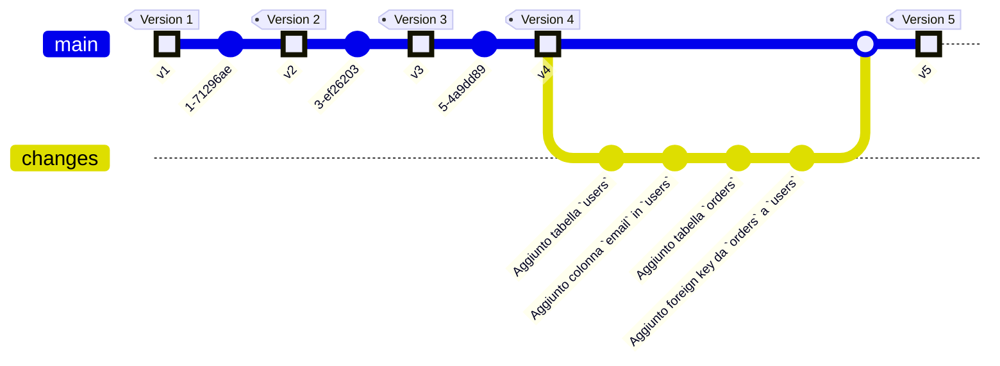

# Introduzione

<v-clicks depth="2">

- Il database versioning è una pratica di gestione delle versioni delle strutture e dei dati di un database in modo simile 
alla gestione del codice sorgente in un sistema di controllo delle versioni (VCS). 

- Questa pratica è fondamentale per mantenere la coerenza, la tracciabilità e la riproducibilità delle modifiche apportate 
al database nel tempo, soprattutto in ambienti di sviluppo software complessi dove più sviluppatori lavorano in modo
distribuito e collaborativo e dove il database è un componente critico del sistema.

- **Obiettivi principali**
  - Ricreare un database da zero.
  - Mantenere sempre chiaro lo stato del database.
  - Migrazione deterministica dalla versione corrente del database a una più recente o anche più vecchia.
  - Assicurare che tutti gli sviluppatori lavorino con la stessa versione del database.
  - Facilitare il deployment delle modifiche al database (preferibilmente con strumenti CI/CD)
  - Permettere il rollback in caso di errori.

</v-clicks>

---
layout: default
---

<!--
Alla pari di qualunque progetto software (C/C++, Erlang, Java, etc.) anche per le DDL/DML del database dovremmo arrivare a una situazione di versioning come quella mostrata.

Soffermarsi un attimo per spiegare il minimo indispensabile su questo diagramma.
-->
